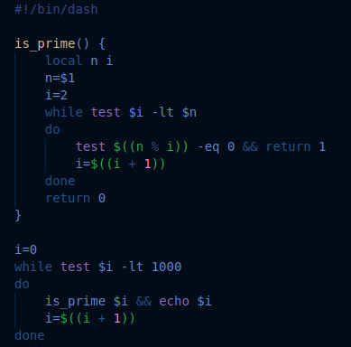
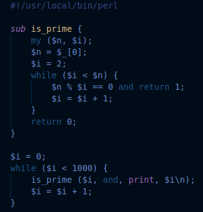
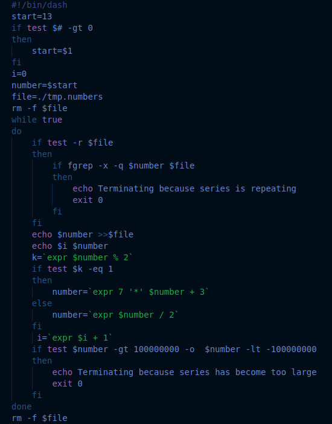
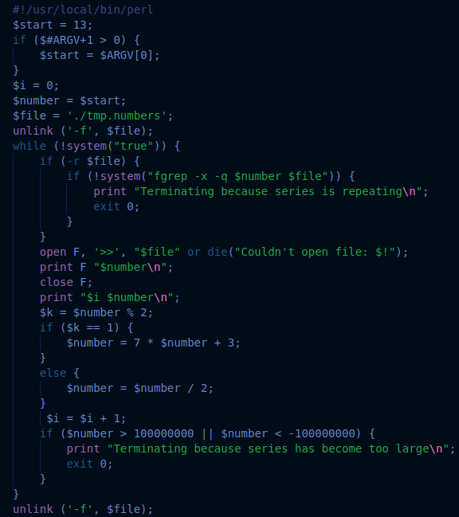

# Shell To Perl Transpiler
An experimental transpiler that maps POSIX-compatible shell scripts to their equivalent Perl 5 scripts. Supports most control structures and some builtin commands. Aims to preserve comments and indentation. 

### Example Usage:
1. Cloning this repo: `git clone https://github.com/Tymotex/ShellPerlTranspiler && cd ShellPerlTranspiler`
2. Converting scripts: `sh2pl <shell script>`

Eg. `./sh2pl examples/primes.sh`

Eg. `./sh2pl examples/series.sh`

